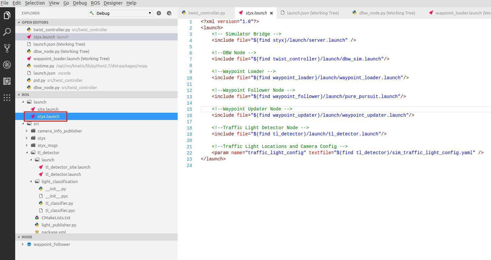
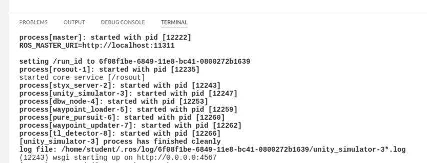

# Programming a Real Self-Driving Car

This is the final project of the Udacity Self-Driving Car Nanodegree: Programming a Real Self-Driving Car. The goal let vehicle move smoothly by planned trajectory, analyze video stream from front camera and smoothly stop on traffic lights when it red. This code is designed for Udacity self-driving car with name **Carla** (vehicle model is Lincoln MKZ). But you can run it on the simulator (see instructions below).


## RealSDC Team introduction
This project was developed by our **RealSDC** team:

### **Victor Mauze**
[admin@mcounter.com.ua](mailto:admin@mcounter.com.ua)

*Ukraine, Microsoft Dynamics AX Senior Technical Architect*

Team Lead, PID throttle and steering controller, integration of functional parts, testing

### **Marius Jansen**
[mariusb.jansen@googlemail.com](mailto:mariusb.jansen@googlemail.com)

*Germany, Function Developer Driver Assistance Systems*

Traffic-lights classification (SSD model, HSV model), testing

### **Armin Sadighi**
[sadighi.armin@gmail.com](mailto:sadighi.armin@gmail.com)

*Germany, Technical University of Munich*

Waypoints loading and updating

### **Santiago Inigo**
[santiago.inigo@gmail.com](mailto:santiago.inigo@gmail.com)

*Spain*

Training dataset for traffic-lights classifier

### **Christian Vasquez**
[chr.vas.per@gmail.com](mailto:chr.vas.per@gmail.com)

*United Kingdom*

Traffic-lights classifier (CNN model)

## Project writeup
If you want to know more about approaches was used in the project, read next document for reference: [RealSDC project writeup](./writeup.md)

## References
For more information about the project, see the project introduction [here](https://classroom.udacity.com/nanodegrees/nd013/parts/6047fe34-d93c-4f50-8336-b70ef10cb4b2/modules/e1a23b06-329a-4684-a717-ad476f0d8dff/lessons/462c933d-9f24-42d3-8bdc-a08a5fc866e4/concepts/5ab4b122-83e6-436d-850f-9f4d26627fd9).

## Installation
We recommend use pre-configured virtual machine provided by Udacity. But you can install native environment or use Docker.

### Virtual machine
Download [compressed disk](https://s3-us-west-1.amazonaws.com/udacity-selfdrivingcar/Udacity_VM_Base_V1.0.0.zip) for [VirtualBox](https://www.virtualbox.org/wiki/Downloads) and follow next instructions:

1. Download and install VirtualBox.
2. Download the image from supplied link.
3. Unzip the image.
4. Open VirtualBox Application.
5. Click File > Import Appliance..
6. Click the folder icon on the right and navigate to your unzipped image (the .ovf file).
7. Follow the prompts to import the image.
8. From the VirtualBox Manager, select your VM and press start.

**Note:** Before getting your VM up and running, you will need to make sure that you allocate enough resources to allow it to operate efficiently.

To test on the simulator you need download and install it: [Udacity Simulator](https://github.com/udacity/CarND-Capstone/releases). It's **not** recommended install simulator on the virtual machine directly. Download version for your **host** computer, install it and configure port forwarding on the virtual machine (see Port Forwarding chapter below).
### Port Forwarding
For security reasons, the VM does not automatically open port forwarding, so you need to manually enable port **4567**. This is needed for the ROS to successfully connect to the host simulator.

**Port Forwarding Instructions:**
1. First open up Oracle VM VirtualBox
2. Click on the default session and select settings.
3. Click on Network, and then Advanced.
4. Click on Port Forwarding
5. Click on the green plus, adds new port forwarding rule.
6. Add a rule that assigns 4567 as both the host port and guest Port, as in the screenshot

.

### Native Installation

* Be sure that your workstation is running Ubuntu 16.04 Xenial Xerus or Ubuntu 14.04 Trusty Tahir. [Ubuntu downloads can be found here](https://www.ubuntu.com/download/desktop).
* If using a Virtual Machine to install Ubuntu, use the following configuration as minimum:
  * 2 CPU
  * 2 GB system memory
  * 25 GB of free hard drive space

  The Udacity provided virtual machine has ROS and Dataspeed DBW already installed, so you can skip the next two steps if you are using this.

* Follow these instructions to install ROS
  * [ROS Kinetic](http://wiki.ros.org/kinetic/Installation/Ubuntu) if you have Ubuntu 16.04.
  * [ROS Indigo](http://wiki.ros.org/indigo/Installation/Ubuntu) if you have Ubuntu 14.04.
* [Dataspeed DBW](https://bitbucket.org/DataspeedInc/dbw_mkz_ros)
  * Use this option to install the SDK on a workstation that already has ROS installed: [One Line SDK Install (binary)](https://bitbucket.org/DataspeedInc/dbw_mkz_ros/src/81e63fcc335d7b64139d7482017d6a97b405e250/ROS_SETUP.md?fileviewer=file-view-default)
* Download the [Udacity Simulator](https://github.com/udacity/CarND-Capstone/releases).

### Docker Installation
[Install Docker](https://docs.docker.com/engine/installation/)

Build the docker container
```bash
docker build . -t capstone
```

Run the docker file
```bash
docker run -p 4567:4567 -v $PWD:/capstone -v /tmp/log:/root/.ros/ --rm -it capstone
```

### Usage

1. Clone the project repository
```bash
git clone https://github.com/mcounter/RealSDC.git
```

2. Install python dependencies
```bash
cd RealSDC
pip install -r requirements.txt
```

**Note:** you may need use ```sudo pip install -r requirements.txt```

3. Make and run styx
```bash
cd ros
catkin_make
source devel/setup.sh
roslaunch launch/styx.launch
```
4. Run the simulator

### RoboWare Studio IDE
In our development process we used [RoboWare Studio](http://www.roboware.me). It's **not** required for this project. But you may find it very **convenient**.

RoboWare Studio is based on Microsoft open source [VSCode](https://code.visualstudio.com) project and already preconfigured to work with ROS, has Git integration and features for debugging your code on C++ and Python. It’s easy to install and start work on project:

1. Install RoboWare Studio, clone project repository and install python dependencies as was described before.
2. Go to File > Open Workspace, open Catkin workspace located in /home/student/RealSDC/ros folder.
3. Click ROS > Open ~/.bashrc, find "# Source ROS" line and change next line to: source /home/student/RealSDC/ros/devel/setup.bash
4. Click ROS > Build to build your project. It must be compiled without errors.
5. Launch /home/student/RealSDC/ros/launch/styx.launch file:



You must see something like this in build-in terminal:


For debugging of Python code it's required to install [PTVSD 3.0.0](https://code.visualstudio.com/docs/python/debugging). You can use remote debugging (see Remote debugging chapter in this document) for local debugging as well. Add these lines at the beginning of .py file you want start debug from. It will be possible to debug all referenced files as well.

```
import ptvsd
ptvsd.enable_attach("my_secret", address = ('127.0.0.1', 3000))
ptvsd.wait_for_attach()
```


### Real world testing
If you want do some tests on recorded data from real self-driving car, follow next instructions:

1. Download [training bag](https://drive.google.com/file/d/0B2_h37bMVw3iYkdJTlRSUlJIamM/view?usp=sharing) that was recorded on the Udacity self-driving car.
2. Unzip the file
```bash
unzip traffic_light_bag_file.zip
```
3. Play the bag file
```bash
rosbag play -l traffic_light_bag_file/traffic_light_training.bag
```
4. Launch your project in site mode
```bash
cd CarND-Capstone/ros
roslaunch launch/site.launch
```
