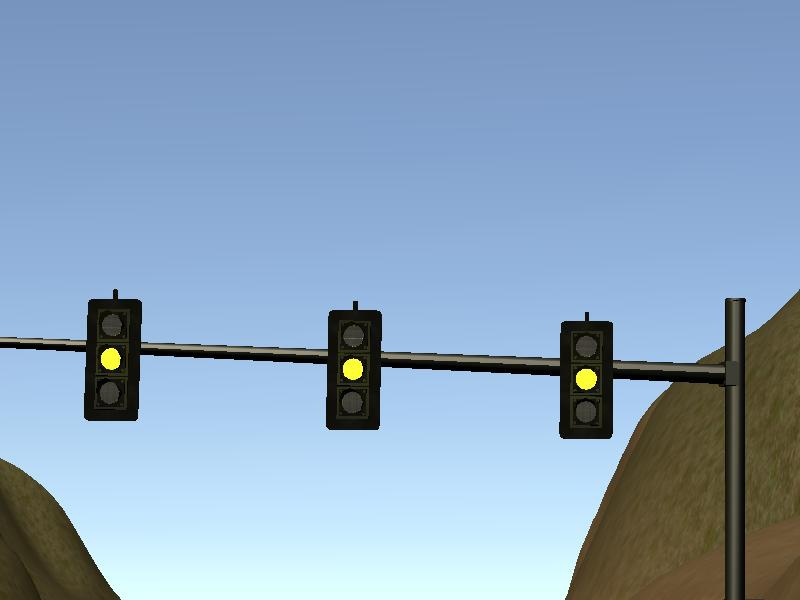
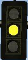

# Traffic light detection
One task in the final project of the Udacity Nanodegree Self-Driving Car Engineer was to stop the automated car at stop lines corresponding to traffic lights.

This led to the subtasks

* find the next stop line ahead
* detect the current state of a traffic light

## Find the next stop line ahead
For the first subtask there was already a nice tutorial called “Detection Walkthrough” on the Udacity website by Eren and Steven. The code is written in the file _tl_detector.py_ and mainly resides in the function _process_traffic_lights_. The function compares the current position of the car with the planned waypoints and then checks for the next stop line corresponding to a traffic light. So eventually the interesting outcome is the distance to the next stop line.

## Detect the current state of a traffic light
After that the traffic light state needs to be determined. The outcome of the classification (labels) are the following.

* red
* yellow
* green
* unknown

The input to this task is video data. So eventually images from the video stream need to be classified. We thought of different approaches.

We looked into options b and c and finally chose c.

### Traffic light detection pipeline

#### Tensorflow Object Detection API 

[GitHub Repository Tensorflow object detection API](https://github.com/tensorflow/models/tree/master/research/object_detection).
The tensorflow object detection API allows to localize and identify multiple objects in a single image. It has already been used in projects for the Udacity nanodegree by several teams successfully. So we decided to have a look into it.

The API can be used with different models from the so called [object detection model zoo](https://github.com/tensorflow/models/blob/master/research/object_detection/g3doc/detection_model_zoo.md). These models in the zoo are basically detection models pre-trained on datasets like the COCO dataset. [Website COCO dataset](http://cocodataset.org).

Happily the COCO dataset already contains traffic lights and the models are pretrained on them.

There is the possibility to train locally (from scratch or transfer learning) [Link](https://github.com/tensorflow/models/blob/master/research/object_detection/g3doc/running_locally.md). Therefore images need to be in the tfrecord format. This is documented [here](https://github.com/tensorflow/models/blob/master/research/object_detection/g3doc/using_your_own_dataset.md).

In order to create our own dataset based on the simulator and Udacity data we already provided [this script](https://github.com/mcounter/RealSDC/blob/master/Test_Images/Simulator/test/conv2tfrec.py). It is able to convert png or jpg images with label data XML files in [PASCAL VOC](http://host.robots.ox.ac.uk/pascal/VOC/) format for example labelled with the tool [labelImg](https://github.com/tzutalin/labelImg)

We tried out different models from the zoo

* [ssd_mobilenet_v1_coco_2017_11_17](https://github.com/tensorflow/models/blob/master/research/object_detection/object_detection_tutorial.ipynb) which was the default from the object detection jupyter notebook,
* [ssdlite_mobilenet_v2_coco_2018_05_09](http://download.tensorflow.org/models/object_detection/ssdlite_mobilenet_v2_coco_2018_05_09.tar.gz) and 
* [ssd_mobilenet_v2_coco_2018_03_29](http://download.tensorflow.org/models/object_detection/ssd_mobilenet_v2_coco_2018_03_29)

We found ssd_mobilenet_v1_coco_2017_11_17 is the best trade off between accuracy and speed for both simulation and real data. And happily enough already robust enough so we did not even need to perform additional training.

**The pipeline starts with CLACHE normalization algorithm applied on the whole image.**

So detecting a traffic light is necessary but not sufficient. The next step is to extract the bounding box and feed it into the next stage, which has the task to determine the state (red, yellow, green) of the traffic light. We found a proposal for a solution [here](https://github.com/udacity/iSDC-P5-traffic-light-classifier-starter-code/blob/master/Traffic_Light_Classifier.ipynb) which was a project in former/future? times of the Udacity SDC Nanodegree. In the end we did not use it because of bad performance on real data.

##### Visualization

↓ (whole image to extract a single traffic light)

#### Color Detection
The pipeline we chose is again a CNN with the labels red, yellow, green and unknown. "Unknwon" can especially help to prevent false positives from the first stage (traffic light detection). We were using a low probability to accept traffic lights in order to not miss any of them in the first place.

##### Visualization

↓ (single traffic light with dominant color)

COLOR = YELLOW

#### Layout of CNN color detection of traffic lights

The layout of the network we used is as follows.

| Layer | Description |
|:-----:|:-----------:|
| Input | 32x32x3 - Normalized image RGB |
| Convolution 3x3 | 1x1 stride, VALID padding, outputs 30x30x32 |
| ReLU |  |
| AVG pooling	2x2 | 2x2 stride, outputs 15x15x32 |
| Convolution 4x4 | 1x1 stride, VALID padding, outputs 12x12x48 |
| ReLU |  |
| AVG pooling	2x2 | 2x2 stride, outputs 6x6x48 |
| Convolution 3x3 | 1x1 stride, VALID padding, outputs 4x4x64 |
| ReLU |  |
| Dropout | Probability of dropout 50% |
| Fully connected	| 1024x300 |
| ReLU |  |
| Dropout | Probability of dropout 50% |
| Fully connected	| 300x200 |
| ReLU |  |
| Dropout | Probability of dropout 50% |
| Output layer | 200x43 (number of classes) |
| Softmax | 	|
| Model loss | Model loss is calculated as sum of Cross-entropy averaged by whole training batch and L2-loss calculated for each weight in fully-connected layers and multiplied by fixed regularization factor	|

Dropouts were used between fully-connected layers and after last convolutional layers. Any dropouts between convolutional layers decreased model performance, so it was not used at all.

This concludes the description of the traffic light detection and color classification pipeline.