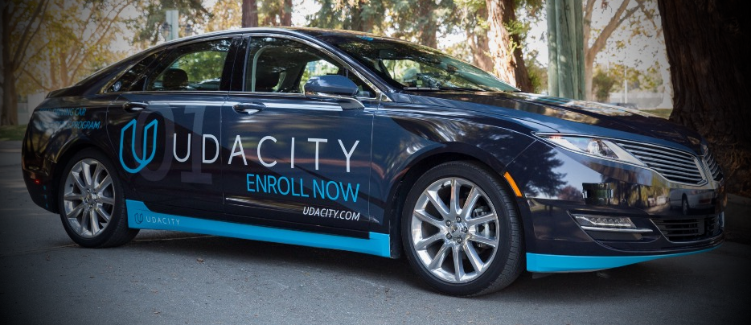
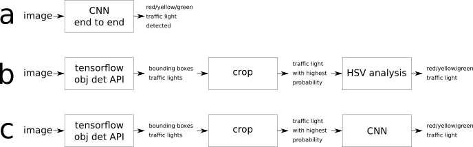

# Programming a Real Self-Driving Car

This is the final project of the Udacity Self-Driving Car Nanodegree: Programming a Real Self-Driving Car. The goal let vehicle move smoothly by planned trajectory, analyze video stream from front camera and smoothly stop on traffic lights when it red. This code is designed for Udacity self-driving car with name **Carla** (vehicle model is Lincoln MKZ). But you can run it on the simulator (see instructions below).

## Waypoints updater
Our car can follow previously planned waypoints with help of throttle and steering controller. But to stop before traffic light set of waypoints must be dynamically updated to make sure vehicle stop smoothly and in correct place. And it must not depend on vehicle speed.

**Input data:**
1. Set of previously planned waypoints, fixed list.
2. List of traffic lights with position of stop-line, fixed list.
3. Current vehicle speed
4. Current vehicle position

**Base algorithm steps:**
1. The first thing we need identify distance to traffic light when we start slowdown our car. This distance depends on many external factors we don't know and from vehicle speed. In ideal conditions it will be `D = alfa * speed^2`. But experiments show us that better formula is `D = alfa * speed^1.5`. It was tested on velocities from 20 to 160 km/h on the simulator. When we know distance, we know number of waypoints to be planned. It's not fixed value and depends on distance between waypoints.
2. Find slowdown formula. Intuition and experiments show us that it must start from something like `V = D^0.3` to start slowdown smoothly and finish with something like `V = D^3.5` to stop directly in necessary place. V - is velocity, D - distance from waypoint to stop line. We dynamically switch between these two formulas depends on real vehicle speed and publish updates to waypoints. Exact coefficients were selected empirically.
3. Additionally we must take in account fact that very small values of velocity will be converted by throttle controller to zero value, so 2 last waypoint must be planned as small jump between some reasonably small speed value (like 2.0 m/s) and zero value. In this case vehicle will be stopped in correct place smoothly.

## Throttle controller
Throttle controller manages vehicle acceleration and deceleration based on planned values.

**Input data:**
1. Vehicle planned speed (target)
2. Real vehicle speed

**Base algorithm steps:**
1. Algorithm is based on the classic implementation of PID controller which takes in account current and target vehicle velocity, derivative of velocity and accumulated value of derivatives for the last small period of time (3 seconds).
2. To minimize jerks in control algorithm we smooth real vehicle velocity value with classic Low pass filter with frequency 2Hz.
3. Small and negative values of PID controller are converted to break commands. Value of brake command depends on vehicle mass and wheel radius.
4. In case planned and current vehicle speed are too low both, full stop command is generated - throttle is 0, break is near 700Nm

## Adaptive steering controller
Steering controller must use vehicle physical characteristics to rotate it smoothly and be adaptive to lateral forces and other real conditions.

**Input data:**
1. Vehicle planned speed (target)
2. Real vehicle speed
3. Predicted turning angle (it's calculated by external algorithm depends on current vehicle position and planned trajectory).

**Base algorithm steps:**
1. First part of algorithm calculates base steering angle proportionally to turning radius and vehicle wheel base (constant). This approach works fine only in case vehicle speed is small enough and lateral forces could be excluded from the formula.
2. The second part compensates lateral forces and other external conditions with help of PD controller. It's the same PID controller used for throttle controller, but with different coefficients and without integral part.
3. Both parts of steering controller just added one to another.
4. To minimize jerks in control algorithm smooth target turning angle with classic Low pass filter with frequency 10Hz. This value is used for both algorithms.

## Traffic light detection
To stop vehicle when traffic light color is red we must analyze images from vehicle front camera, find traffic light on it and analyze it color. Moreover we must use external information about know positions of traffic lights and position of stop lines. It must prevent stopping vehicle in unexpected places.

So the set of tasks we defined:
* Find nearest traffic light position and understand if it close enough
* Analyze images from vehicle front camera and find traffic lights on it
* Analyze sub-images of detected traffic light from previous step and classify it color

First task is simple enough, but two next will be described in more details in the next chapters.

### General architecture review
The input to this task is video data. So eventually images from the video stream need to be classified. We analyzed several different approaches:

1. Approach (a) is end-to-end learning when non-processed images from camera are recognized as one of traffic light state. It requires much data in different conditions. It hopefully will work for simulator, but in real test it can totally fail, because we have not much data available.
2. Approach (b) is SSD boxed model followed by HSV color detector which analyze saturation of each color on the sub-image and return one of 3 results - red, green or yellow. Because limited resources and time available we planned use pre-trained SSD model which not specialized on traffic lights detection. So with high detection threshold it cannot classify many images. With low detection threshold it return many false positives. Sure SSD model is good common pre-processor with pretty well performance. But it must be followed by more accurate classifier and filter. HSV detector cannot play this role itself.
3. Approach (c) is SSD boxed model followed by CNN classifier with 4 states: red/green/yellow/unknown. Unknown state is additional filter of false positives detected by SSD model.
4. Initially we considered one more option - SSD boxed model trained specially for traffic light recognition, including color. It's option 3 combined in one model. This option requires big amount of input data, resources for training and time. But result may be good for this project, but in real life it's too expensive have separate SSD model to recognize every kind of object. The better option - well trained common SSD followed by filter and mode detail classifier of object states.

Option (c) is option we selected finally for our project. Option (b) was implemented as well and was used to simplify training dataset creation for CNN model.

### Traffic light detection pipeline

##### Image pre-processing
The pipeline starts with image histogram normalization with help of Contrast Limited Adaptive Histogram Equalization (CLAHE) algorithm with empirically selected parameters.

#### TensorFlow Object Detection API

[GitHub Repository Tensorflow object detection API](https://github.com/tensorflow/models/tree/master/research/object_detection).
The TensorFlow object detection API allows to localize and identify multiple objects in a single image. We decided use it because it open-source out-of-the-box tool for object detection which support variety models, including models optimized for mobile devices. And it has good choice of models pre-trained on [COCO dataset](http://cocodataset.org) which include traffic lights: [object detection model zoo](https://github.com/tensorflow/models/blob/master/research/object_detection/g3doc/detection_model_zoo.md).

**Note:** There is the possibility to train model locally (from scratch or transfer learning), see the [link](https://github.com/tensorflow/models/blob/master/research/object_detection/g3doc/running_locally.md). Therefore images must be in the tfrecord format. This is documented [here](https://github.com/tensorflow/models/blob/master/research/object_detection/g3doc/using_your_own_dataset.md).

We tried out different models from the zoo:
* [ssd_mobilenet_v1_coco_2017_11_17](http://download.tensorflow.org/models/object_detection/ssd_mobilenet_v1_coco_2017_11_17.tar.gz),
* [ssdlite_mobilenet_v2_coco_2018_05_09](http://download.tensorflow.org/models/object_detection/ssdlite_mobilenet_v2_coco_2018_05_09.tar.gz) and
* [ssd_mobilenet_v2_coco_2018_03_29](http://download.tensorflow.org/models/object_detection/ssd_mobilenet_v2_coco_2018_03_29)

We found ssd_mobilenet_v1_coco_2017_11_17 is the best trade off between accuracy and speed for both simulation and real data. So we selected it for our project.

#### Color Detection
SSD model from the previous step returns many false positives, which must be filtered. One or several images could really be traffic lights, in this case it state must be recognized. Both tasks are solved by one CNN model, trained on set of images from the simulator and from real images provided by Udacity. This model returns one of 4 states, red/green/yellow/unknown. Last one plays role of the filter of false positives detected on the previous step.

The layout of the CNN we used is as follows.

| Layer | Description |
|:-----:|:-----------:|
| Input | 32x32x3 - Normalized image RGB |
| Convolution 3x3 | 1x1 stride, VALID padding, outputs 30x30x32 |
| ReLU |  |
| AVG pooling	2x2 | 2x2 stride, outputs 15x15x32 |
| Convolution 4x4 | 1x1 stride, VALID padding, outputs 12x12x48 |
| ReLU |  |
| AVG pooling	2x2 | 2x2 stride, outputs 6x6x48 |
| Convolution 3x3 | 1x1 stride, VALID padding, outputs 4x4x64 |
| ReLU |  |
| Dropout | Probability of dropout 50% |
| Fully connected	| 1024x300 |
| ReLU |  |
| Dropout | Probability of dropout 50% |
| Fully connected	| 300x200 |
| ReLU |  |
| Dropout | Probability of dropout 50% |
| Output layer | 200x4 (number of classes) |
| Softmax | 	|
| Model loss | Model loss is calculated as sum of Cross-entropy averaged by whole training batch and L2-loss calculated for each weight in fully-connected layers and multiplied by fixed regularization factor	|

Dropouts were used between fully-connected layers and after last convolutional layers. Any dropouts between convolutional layers decreased model performance, so it was not used at all.
